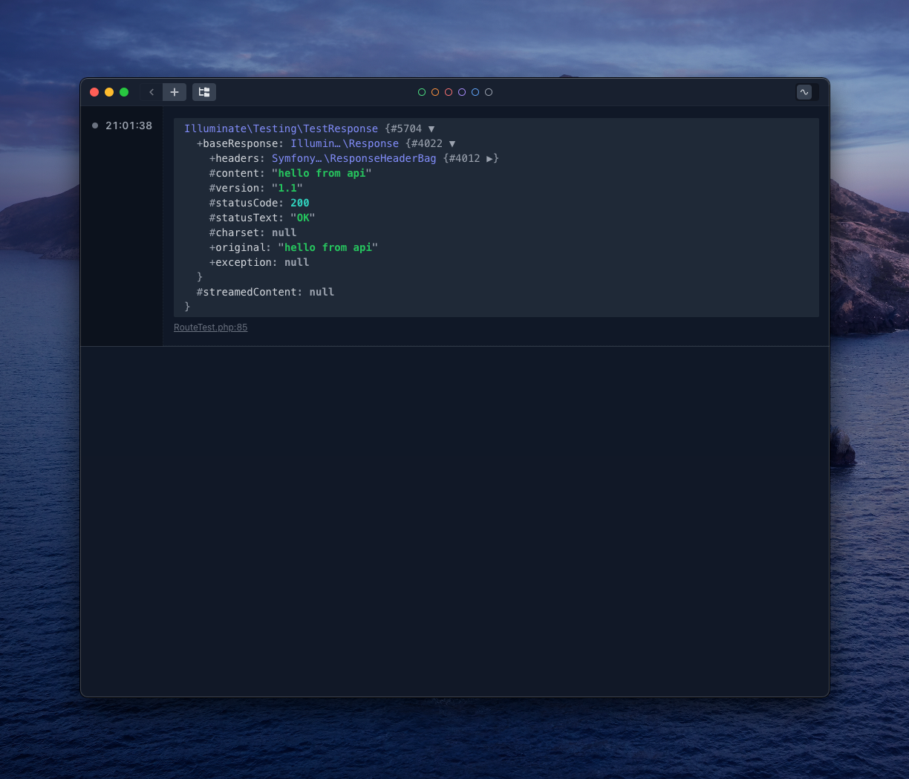
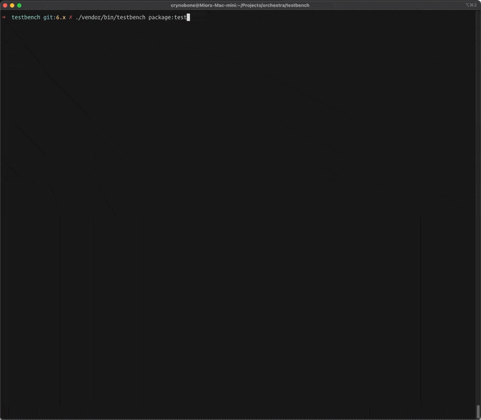

# Integrations

Testbench hopes to provide a complete solution for package developments, in latest version we now support direct integrations with following 3rd party packages:

## Spatie Ray

Starting from Testbench 6.10 you may now use Ray debugging tool directly when running tests. 

```php
    /** @test */
    public function it_can_resolve_domain_route()
    {
        $response = $this->get('http://api.localhost/hello');

        ray($response);
    }
```



## Collision

You can also utilise Collision with Testbench to use Laravel flavored artisan test command, including parallel testing. First of all include `nunomaduro/collision` to your package:

```
composer require --dev "nunomaduro/collision"
```


